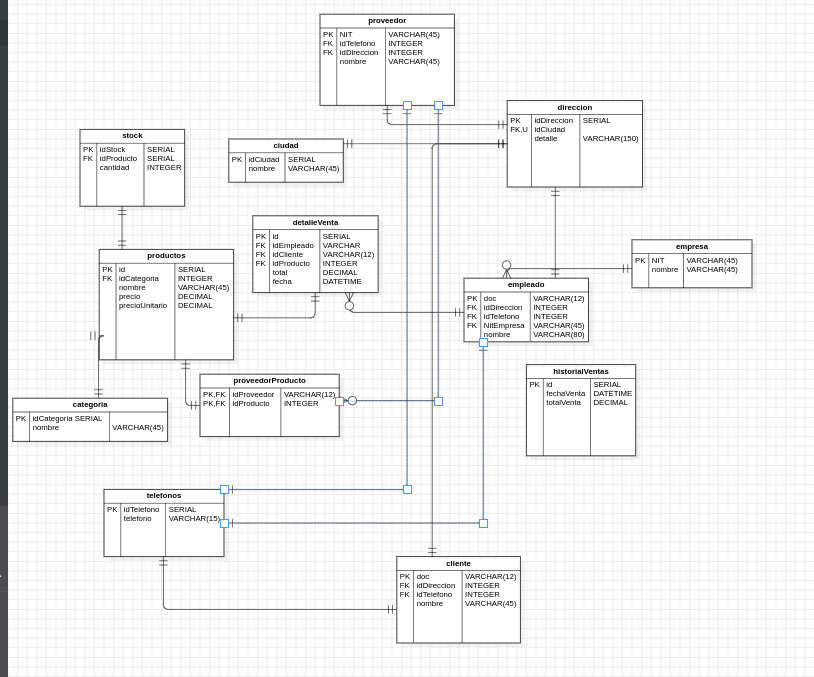

```markdown
# 🏪 Gestión de Inventario para la Tienda TechZone


El sistema permite:

- Gestionar productos con su stock, categoría y proveedor.
- Registrar clientes y ventas.
- Validar el stock antes de realizar ventas.
- Automatizar el control de inventario y analizar información clave como los productos más vendidos y los clientes más frecuentes.

---

## 📷 Modelo Entidad-Relación




## 📈 Consultas Avanzadas Incluidas

1. **Productos con stock menor a 5 unidades**
2. **Ventas totales de un mes específico**
3. **Cliente con más compras realizadas**
4. **Top 5 productos más vendidos**
5. **Ventas en un rango de fechas (3 días y 1 mes)**
6. **Clientes que no han comprado en los últimos 6 meses**

---

## ⚙️ Procedimientos Almacenados

### `registrar_venta(idEmpleado, documentoCliente, idProducto, cantidad)`

Este procedimiento:

- Verifica si el cliente existe.
- Valida si el producto existe.
- Comprueba el stock antes de registrar la venta.
- Si hay stock suficiente: registra la venta y actualiza inventario.
- Si no hay stock: muestra un mensaje con `RAISE NOTICE`.

